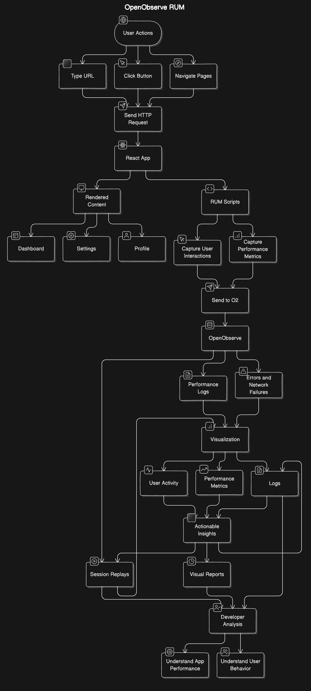

# User Portal App Setup with OpenObserve (Demo Purpose Only)

**Note**: This setup is purely for **demo purposes only** and should not be used in production environments. The goal is to demonstrate how OpenObserve can be used for observability and log ingestion, and how the React app integrates with it for real user monitoring (RUM).



This repository contains two directories:
- `user-portal-app`: A React app for the user portal.
- `openobserve-setup`: A script to automatically set up OpenObserve for log ingestion and observability.

## Prerequisites

- Ensure that you have the following installed on your system:
  - **Node.js** (version 14 or higher)
  - **npm** (comes with Node.js)
  - **Git**
  - **curl**

## Getting Started

### Step 1: Set Up OpenObserve

1. **Navigate to the `openobserve-setup` directory**:

    ```bash
    cd openobserve-setup
    ```

2. **Run the setup script**:

    The script will prompt you for the root user email and password for OpenObserve. This will set up OpenObserve, download sample Kubernetes logs, and ingest them.

    ```bash
    ./setup_openobserve.sh
    ```

3. **Access OpenObserve**:

    Once the script finishes running, OpenObserve will be accessible locally at:

    ```
    http://localhost:5080
    ```

4. **Obtain the RUM Token**:

    After logging into the OpenObserve UI, navigate to **Ingestion** to find the **RUM Token**. This token is needed to track and visualize real user monitoring (RUM) data.

### Step 2: Set Up the React App

1. **Navigate back to the `user-portal-app` directory**:

    ```bash
    cd ../user-portal-app
    ```

2. **Install dependencies**:

    If this is the first time you're running the React app, you need to install all the required dependencies:

    ```bash
    npm install
    ```

3. **Replace the `clientToken` in `src/App.js`**:

    Open the file `src/App.js` and replace the placeholder `clientToken` with the RUM token you retrieved from OpenObserve:

    ```javascript
    const clientToken = 'your-rum-token-here';
    ```

4. **Start the React App**:

    Once you've replaced the `clientToken`, you can start the React app:

    ```bash
    npm start
    ```

5. **Access the React App**:

    After running the command, the app will be accessible at:

    ```
    http://localhost:3000
    ```

## Troubleshooting

- If the OpenObserve setup fails, ensure that no other services are using port `5080`.
- Ensure that Node.js and npm are correctly installed and that your version is compatible with the project.

## Additional Information

- You can view the logs and output of OpenObserve in the `openobserve.log` file located in the `openobserve-setup` directory.
- To stop the OpenObserve server, you can find the process ID by running `ps aux | grep openobserve` and then kill the process using `kill -9 <process_id>`.

## Disclaimer

This setup is purely for **demo purposes only**. It is not intended for use in production environments. The focus is on demonstrating how to set up OpenObserve and integrate it with a React app for real user monitoring and log ingestion.
